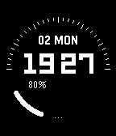
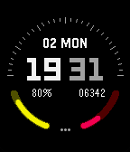
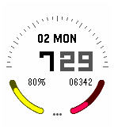
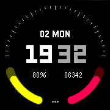
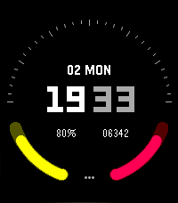

# Dual Arc

A modern digital watchface combining style and functionality. Features include large split time display (hours/minutes), date with weekday, dual quarter-circle progress indicators for battery and step tracking, customizable color themes, and support for both 12 and 24-hour formats. Perfect for users who want essential information in a clean, minimalist design.

## Screenshots
### Pebble Classic/Steel/2/Duo

### Pebble Time/Time Steel

### Pebble Time Round

### Pebble Time 2

## Store
[Rebble App Store](https://apps.rebble.io/en_US/application/)

## Support
For issues, questions, or suggestions, please open an issue on GitHub.

## License
MIT License - feel free to modify and share!

---
Built with ❤️ for the Pebble community
